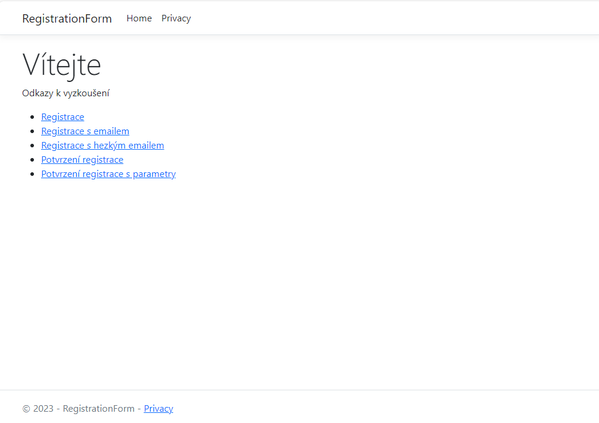
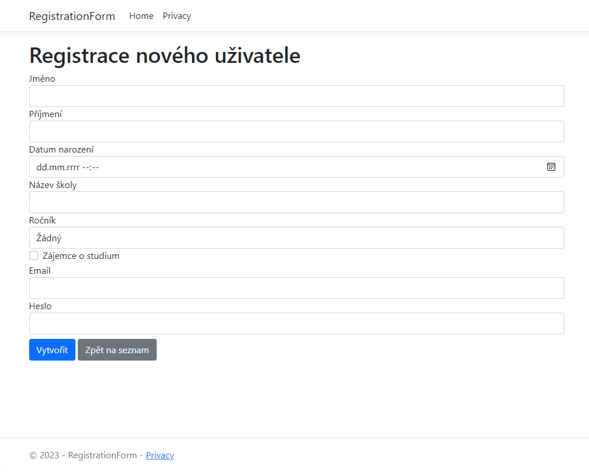
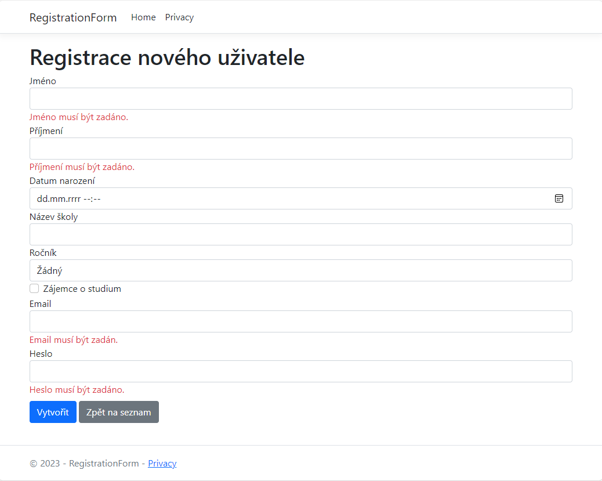
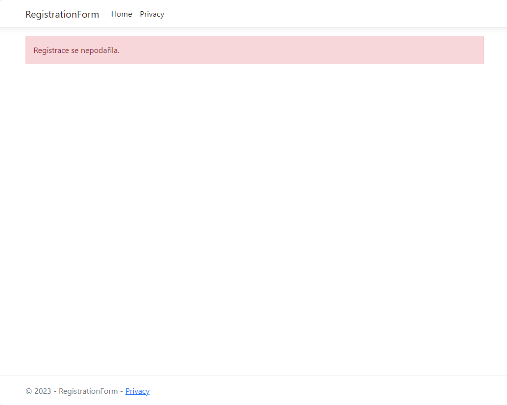
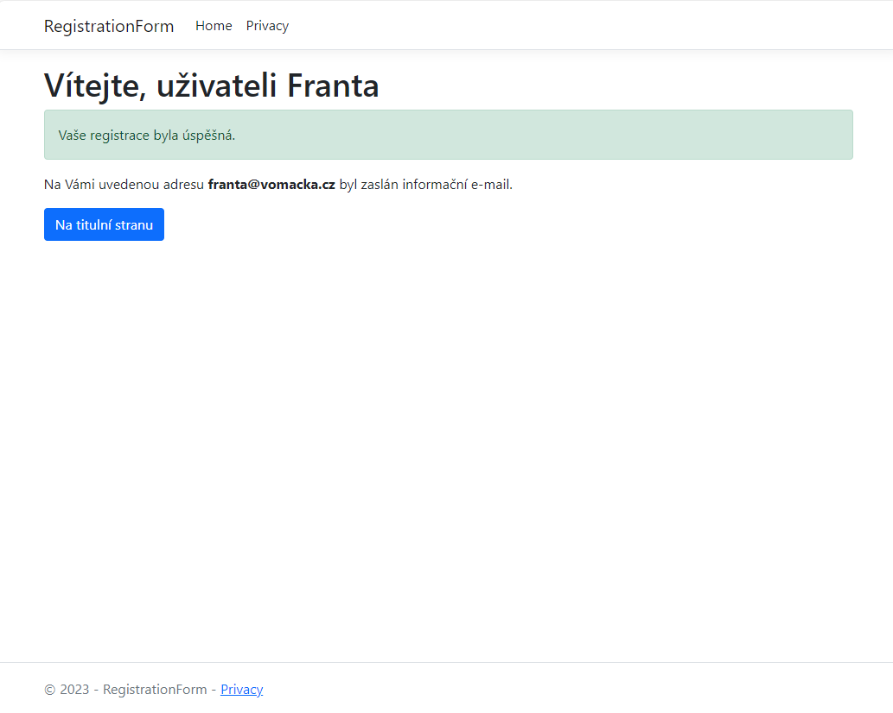

# Stránky, odkazy, formuláře a přesměrování

Vytvořte část aplikace fungující podle přiložených screenshotů:

Index

Register po načtení

Register po neúspěšné validaci

RegistrationResult s nedostatkem dat

RegistrationResult se správnými parametry

## Úkoly

K dispozici máte rozpracované stránky Index, Register a RegistrationResult, soubor pro input model RegisterIM a hotový enum SchoolGrade.

### RegisterIM

Upravte IM tak, aby pracoval s položkami formuláře Register a vracel příslušné validační zprávy.
* FirstName - povinná
* LastName - povinná
* BirthDate
* SchoolName
* Grade - povinná - enum SchoolGrade
* Aspirant - checkbox
* Email - povinná
* Heslo - povinná

### Register
* Má pracovat s RegisterIM
* Je schopný nastavovat hodnotu Email podle parametru stránky
    * Register
    * Register?email=x@x.x
    * Register/x@x.x
    * ideálně vše najednou přes nepovinný pretty parametr
* Po odeslání dat proběhne jejich validace a je-li úspěšná proběhne přesměrování s předanými parametry firstname a email
 
### RegistrationResult
* Pokud dostane správně parametry email a firstname zobrazí potvrzovací hlášku
* Jinak informuje uživatele, že registrace neproběhla
* Přes helpery zde funguje odkaz na titulní stránku

### Index
* Vytvořte korektní a vždy funkční (přes helpery) odkaz na stránku s registrací předávající parametr email
